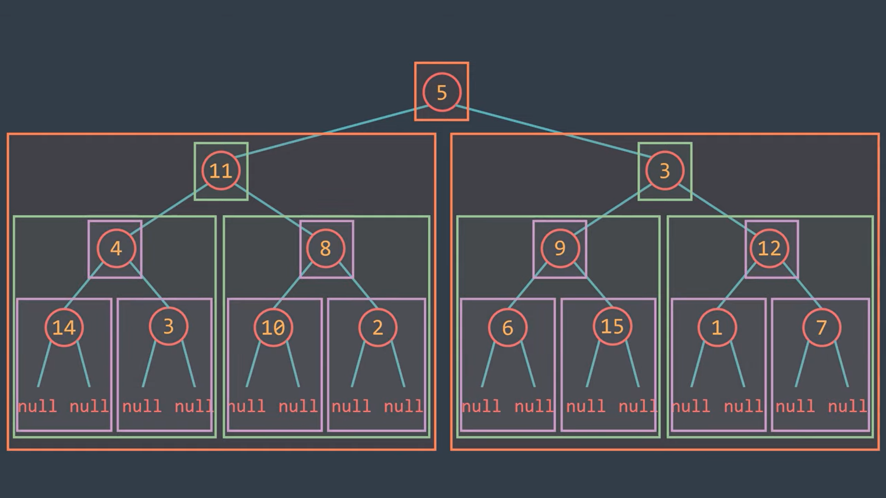

# Binary Trees
Binary trees are a special type of tree in which each node has at most two children. Binary trees.

All binary tree follow a similar kind of pattern. 

- Finding one or more base cases , which is must for recursion.
- Calling the same function on left 
- Calling the same function on right
- joining the result.

The following image shows pictorial representation.




**Observation 1**: it is very important to understand difference in calculating min and max depth of binary tree.

**For finding min Depth**: Requires checking for null children and handling them differently because the path must continue down the existing child to reach a leaf node.

```cpp
 if(root->left)
         l = minDepth(root->left);
 if(root->right)
         r = minDepth(root->right);
```

**For finding max Depth**:Simply takes the maximum depth of both subtrees and adds one, as the presence of null children does not affect the longest path calculation.

These differences arise from the fundamental definitions of minimum and maximum depth and how they relate to the structure of the tree.

Preorder application 
-  path sum
-  